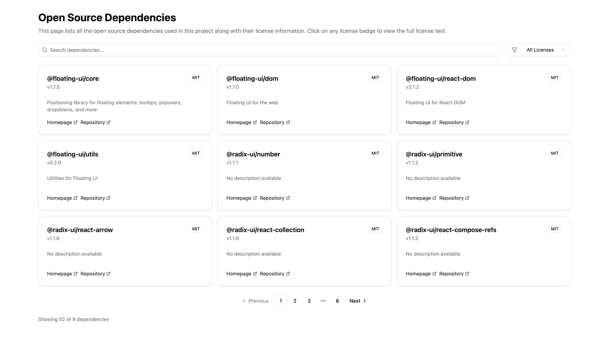

# Vite Plugin OSS Licenses

👇 Vite plugin that facilitates the direct, seamless import of comprehensive license lists for all direct and transitive dependencies, integrated directly within JavaScript without extra build step.



## ✨ Features

- [x] 📀 **Automatic License Extraction** Extracts all licenses of direct and transitive dependencies automatically.
- [x] 📝 **TypeScript Support** Fully typed license file imports without extra build steps.
- [x] ⚡ **Performance Optimized** Designed for Vite code splitting.
- [x] 🎨 **Demo Components** Ready-to-use components for React (Tailwind, Shadcn, Zustand) and more.
- [x] 🚀 **Lightweight & Fast** Minimal overhead, optimized for performance.
- [x] 🔧 **Easy Integration** Simple setup for quick use in projects.

## 💾 Getting Started

Install the package using your favorite package manager, e.g. directly via npm:

```bash
npm install @loggd/vite-plugin-oss-licenses
```

To be able to import the licenses, it is as simple as adding the plugin to your Vite config:

```typescript
import { vitePluginOSSLicenses } from '@loggd/vite-plugin-oss-licenses';
import { defineConfig } from 'vite';

export default defineConfig({
  plugins: [vitePluginOSSLicenses()],
});
```

Now just embed the licenses in your app like this. The following example uses React, but you can use it in any JavaScript framework, because the plugin is framework agnostic.

```tsx
import licenses from 'virtual:oss-licenses';

export const FilterPage = () => {
  return (
    <div>
      {licenses.map((license) => (
        <div key={license.name}>
          {license.name}@{license.version} - {license.license}
        </div>
      ))}
    </div>
  );
};
```

For the `virtual:oss-licenses` import to be fully typed, you also need to add the types to your typescript config or to the `vite-env.d.ts` file.

Either in the `📄 tsconfig.json`

```json
{
  "compilerOptions": {
    "types": ["vite/client", "@loggd/vite-plugin-oss-licenses/client"]
  }
}
```

or in the `📄 vite-env.d.ts`

```typescript
/// <reference types="vite/client" />
/// <reference types="@loggd/vite-plugin-oss-licenses/client" />
```

## 🎨 Components

This repository focuses on providing the plugin, so that everyone can use it for their custom needs. However, we also provide a few components that can be used to display the licenses in a nice way as you seen in the demo above. The components are designed to be as independent as possible for their defined tech stack. **So just copy and paste the components you need into your own project**.

**Look at the playground directory for component examples. Currently we provide components for the following tech stacks:**

- React (tailwindcss, shadcn/ui, zustand) in `playground/react`

## 🚀 Performance considerations

By default, the plugin will automatically bundle all licenses into a standalone javascript file. This enables that users don't have the overhead of loading all licenses in the main bundle. However there are more steps needed if integrating with libraries like react, so that the main `index.html` file just doesn't load the license file out of the box for every route.

Setup for Code Splitting in `React` can look like this. This will create a separate chunk for the license page, so that the generated license file is only loaded when the user navigates to the license page.

```tsx
const LazyLicensePage = lazy(() =>
  import('$/pages/LicensePage').then((res) => ({ default: res.LicensePage }))
);

export const LicensePage = () => {
  return (
    <Suspense fallback={<div>Loading...</div>}>
      <LazyLicensePage />
    </Suspense>
  );
};
```

## ©️ License

This project and each package it provides is licensed under the MIT License - see the [LICENSE](LICENSE) file for more details.
